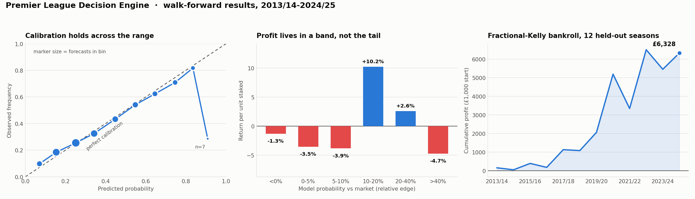

# Premier League Decision Engine

> **Coming back to this after a while?** Read
> **[WHAT_THIS_PROJECT_IS.md](WHAT_THIS_PROJECT_IS.md)** first — it explains the
> whole system in plain English in about ten minutes, including the parts that
> are broken. Then look at
> **[the scorecard](https://upendra657.github.io/Premier-League-Predictor/scorecard.html)**,
> which is 4,509 real predictions and how often each was wrong.

Predicting Premier League matches is easy. Predicting them *better than a
bookmaker* is not — and that turns out to be the interesting problem.

This started as a fairly ordinary classifier: throw twenty-five seasons of
results at XGBoost, split randomly, report accuracy, done. It got about 53%
right, which sounds respectable until you notice that always picking the home
team gets you 46%, and that a random split over time-ordered fixtures is
quietly training on the future.

So I rebuilt it around a different question. Not *who wins* — bookmakers answer
that better than I can — but **where is the market wrong, by how much, and what
would you stake on it?**

That reframing changes everything downstream: what you optimise, how you
validate, and what counts as success.



**[The scorecard — every prediction, and how often it was wrong →](https://upendra657.github.io/Premier-League-Predictor/scorecard.html)**

**[Live results dashboard →](https://upendra657.github.io/Premier-League-Predictor/)**

---

## What I found

Three things, and the first one sounds like bad news.

### The model loses to the bookmaker — and that's fine

Evaluated walk-forward on 4,509 fixtures across 12 held-out seasons, refitting
after each one so the model never sees a season before predicting it:

| | Brier ↓ | Log loss ↓ | RPS ↓ | ECE ↓ | Accuracy |
|---|---|---|---|---|---|
| Market (de-vigged line) | **0.5634** | **0.9527** | **0.1941** | 0.0105 | **55.7%** |
| Random Forest + isotonic | 0.5762 | 0.9809 | 0.1996 | **0.0093** | 54.3% |
| XGBoost (natively calibrated) | 0.5792 | 0.9789 | 0.2006 | 0.0171 | 53.9% |
| Random Forest, uncalibrated | 0.5902 | 0.9929 | 0.2033 | 0.0212 | 51.5% |

The market wins on Brier, and it should: it has team news, lineups, injuries
and the weight of other people's money. What it doesn't have is a monopoly on
being *well calibrated*.

Those are genuinely different properties. Discrimination is how well you
separate outcomes. Calibration is whether your stated 30% actually happens 30%
of the time. Accuracy is blind to the second one — and staking depends entirely
on it, because Kelly sizing takes your probability at face value.

So a model can lose the headline metric and still be useful, provided you test
the right thing. Which is what the rest of this is about.

### Calibration is a targeted fix, not a free win

I expected calibration to improve both models. It improved one:

| | Brier | ECE |
|---|---|---|
| Random Forest | 0.5902 → 0.5762 (−2.4%) | 0.0212 → 0.0093 (**−56%**) |
| XGBoost | 0.5792 → 0.5808 (+0.3%) | 0.0171 → 0.0172 (+0.2%) |

Random Forest probabilities are vote proportions across 600 trees. Nothing in
the fitting objective penalises miscalibration, so they bunch toward the middle
and isotonic regression has real work to do.

XGBoost trains on `mlogloss` — which *is* a strictly proper scoring rule, so
calibration is already part of the objective. There was nothing left to fix,
and refitting across folds just added noise.

I've kept the null result in because it's the more useful half. "Calibration
improves probabilistic models" is folklore; whether it improves *yours* depends
on what your loss function was already doing.

### Profit lives in a band, not a tail

This one I didn't see coming. Bucketing every candidate bet by how far the
model's probability departs from the de-vigged market price:

| Model vs market | Bets | Hit rate | Return |
|---|---|---|---|
| < 0% | 6,889 | 33.9% | −1.3% |
| 0–5% | 1,129 | 40.3% | −3.6% |
| 5–10% | 1,003 | 37.6% | −3.9% |
| **10–20%** | **1,581** | **37.9%** | **+10.2%** |
| **20–40%** | **1,672** | **31.2%** | **+2.6%** |
| > 40% | 1,253 | 17.9% | −4.7% |

Small disagreements are noise that can't clear the bookmaker's margin. Huge
disagreements are the model being confidently wrong about longshots. The money
is in the middle.

This is why "bet everything with positive expected value" loses — it treats
three different regimes as one signal.

---

## The number I'd actually defend

The strategy makes money. How much depends on how honest you're being:

| Scenario | Bets | Flat-stake ROI | 95% CI | p(ROI ≤ 0) | £1,000 becomes |
|---|---|---|---|---|---|
| Best price across books | 2,154 | +7.2% | +1.3% … +13.4% | 0.007 | £7,328 |
| One bookmaker | 2,166 | +3.2% | −2.4% … +9.2% | 0.125 | £1,838 |
| **Strict holdout** | 877 | **+1.5%** | −9.2% … +12.7% | 0.379 | £1,035 |

That last row is the one that matters. The +7.2% uses a selection band I chose
after looking at the whole sample. Refit that band on 2013/14–2018/19 and apply
it blind to the six seasons that follow, and the edge drops to +1.5% with a
confidence interval straddling zero.

**So the honest read is a marginal, unstable edge in a market that's close to
efficient.** I'd rather report that than a tuned number that falls apart the
first time someone asks a hard question.

One note on which number this is. The ROI above is **flat-stake**: a constant
amount on every selection. That is deliberate — with a fixed stake, ROI on
turnover is just the mean return per unit risked, which isolates *how good the
selection was* from *how the money was sized*. The confidence intervals and
p-values are bootstrapped on that same per-unit series, so they belong to this
column and not to any other. The fractional-Kelly ledger over the identical bets
returned **+4.8%** (`results.json → roi_on_turnover`); the flat figure is the
one to quote when the question is whether the model picked well.

Two things worth knowing alongside it. Maximum drawdown is −47%, and six of
twelve seasons lost money — the equity curve is far bumpier than the headline
suggests. And the biggest single lever wasn't modelling at all: one bookmaker's
margin is 4.49%, while the best price across books is 0.35% (over the 7,570
fixtures priced both ways). That 4-point swing dwarfs every modelling
improvement in this repo combined. Where you transact mattered more than what I
predicted.

---

## How it works

```
src/
├── config.py      Every hyper-parameter, typed, in one place
├── data.py        Ingestion, team-name reconciliation, odds join, de-vigging
├── features.py    Elo, xG proxy, decayed rolling form, fatigue
├── train.py       XGBoost + RF, calibration, walk-forward scoring
├── backtest.py    EV detection, band selection, fractional Kelly
├── report.py      Consolidated results bundle
├── dashboard.py   The HTML results page
├── workbook.py    Formula-driven Excel export
└── main.py        FastAPI inference service
tests/             42 tests, weighted toward leakage and staking correctness
```

**Elo ratings** update after every fixture in one chronological pass. The
K-factor scales with margin of victory — a 4–0 moves ratings more than a 1–0,
with diminishing returns so blowouts don't cause runaway inflation. There's a
65-point home advantage baked into the expectancy curve, and ratings regress
25% toward the mean between seasons to account for transfers and promotion.

**Expected goals, sort of.** The dataset has no real xG, so I fit a Poisson
regression mapping shot volume, shots on target and corners onto goals. Shots
on target dominate the fit, which is reassuring. It's fitted only on the
burn-in season, which is then excluded from everything else. It's a proxy, not
the real thing — see the limitations.

**Form with a memory that fades.** Rolling xG, xGA and points over five
matches, exponentially decayed with a 2.5-match half-life, so last week counts
roughly four times as much as five weeks ago.

**Rest days** — a differential between the sides, clipped at 14 days so the
summer break doesn't swamp it. I originally called this a fatigue metric. It
isn't, and the data says so plainly: the model learned that *more* rest slightly
**reduces** home win probability, and the raw rates agree (50.0% home wins on
0–3 days' rest against 44.9% on 11–14). It isn't a hidden team-quality effect
either — the correlation between rest days and Elo is −0.007. So the signal is
real and my explanation for it was wrong. It also ranks 16th, 17th and 18th of
18 features by gain, so it barely moves anything. I've left it in and relabelled
it rather than quietly deleting the evidence.

### Not leaking the future

This is the part I was most careful about, because leakage is silent — it makes
your numbers better, not worse, so nothing alerts you.

Elo is snapshotted *before* a fixture is scored, then updated. Rolling windows
are lagged one match, so a team's own result is never an input to predicting
it. Rolling state never crosses between teams. The xG model touches only
burn-in seasons. Training is walk-forward. Even the calibration folds are
chronological, so the calibrator never learns from matches that postdate its
own validation slice.

Nine of the 42 tests exist purely to enforce this — including one that fails if
a rolling mean includes its own row, and one that shuffles class order to catch
a `predict_proba` column mismatch.

---

## Running it

```bash
pip install -r requirements-dev.txt

python -m src.data        # ingest + join odds (cached after first run)
python -m src.features    # build the feature store
python -m src.train       # walk-forward evaluation + artifacts
python -m src.backtest    # strategy calibration + held-out performance
python -m src.report      # consolidated results
python -m src.dashboard   # the HTML results page

pytest -q                 # 42 tests
```

### The API

```bash
uvicorn src.main:app --reload
```

Team names are enough. Each side's Elo, decayed form and xG are looked up from
ratings shipped with the model:

```bash
curl -X POST localhost:8000/predict -H 'Content-Type: application/json' \
  -d '{"home_team":"Liverpool","away_team":"Burnley"}'
```

```json
{"home_team":"Liverpool","away_team":"Burnley",
 "prob_home_win":0.8496,"prob_draw":0.1036,"prob_away_win":0.0468,
 "form_as_of":{"home_form_as_of":"2025-05-04","away_form_as_of":"2024-05-19",
               "overridden_fields":[]},
 "most_likely":"home_win"}
```

Note `form_as_of`. Burnley's ratings are a year older than Liverpool's because
they were relegated — the response tells you that rather than quietly serving a
stale number as if it were current. An unknown team gets a `404` listing valid
names, so a typo can't silently become a league-average prediction.

You can override any rating explicitly, which is what makes counterfactuals
answerable — *what if Arsenal were rated 1650 and Chelsea had three days' rest?*

| Endpoint | Does what |
|---|---|
| `GET /health` | Liveness, and whether the model artifact actually loaded |
| `GET /model` | Metadata card with walk-forward metrics |
| `POST /predict` | Calibrated Home / Draw / Away probabilities |
| `POST /value` | Adds edge, expected value and Kelly stake against your odds |

`/value` returns every selection, including the ones outside the profitable
band — with a zero stake and a `recommended: false`, rather than dropping them
silently. Probabilities are rounded by largest remainder so they sum to exactly
1 at four decimal places, because a client computing `1 - home - draw`
shouldn't disagree with the value served.

```bash
docker build -t plde:2.0 .
docker run -p 8000:8000 plde:2.0
```

Multi-stage build. The runtime image carries the virtualenv, `src/` and
`artifacts/` — training dependencies and raw data never ship. Runs unprivileged
with a healthcheck.

---

## Data

Match results for 2000/01–2024/25 (9,380 fixtures) give the spine: outcomes,
shots, corners, cards. 1X2 odds come from a
[football-data.co.uk](https://www.football-data.co.uk/) mirror, both average
and best-of-market, covering 99.1% of fixtures.

The join is validated rather than assumed — ingestion raises if coverage drops
below 95%, because a silent team-name mismatch would otherwise hand you a
meaningless backtest instead of an error. Dates are cross-checked against their
stated season too, after Excel once helpfully rewrote every ISO date into an
ambiguous `M/D/YY`.

---

## What's wrong with it

The full version is in [`docs/LIMITATIONS.md`](docs/LIMITATIONS.md). The short
version:

**The holdout edge isn't statistically significant.** Treat +7.2% as an upper
bound found with hindsight and +1.5% as the honest expectation.

**The model I ship isn't the best-scoring one.** Random Forest with isotonic
calibration wins on Brier, RPS *and* ECE — and loses 18.5% of turnover on
held-out seasons, against +1.5% for the XGBoost I actually serve. Aggregate
calibration is measured across all predictions, but betting only samples the
tail where the model disagrees with the market, and isotonic regression flattens
exactly those disagreements. 279 qualifying bets instead of 877. It's the most
counter-intuitive result here and the one I'd most want you to read.

**Best-price execution may not be achievable.** It assumes accounts everywhere,
catching prices before they move, and not getting limited — which is what
happens to people who consistently beat the closing line.

**xG is a proxy.** A match-level shot-quality regression is not shot-level xG.

**Rolling form isn't venue-split.** Fixtures alternate home and away, so decayed
form entering a home match runs systematically lower than entering an away one
(true for 44 of 46 clubs). The trees absorb most of it, but it's a sloppy
encoding.

**No player data at all.** Injuries, suspensions, rotation — unmodelled, and
plausibly the single largest reason the market out-discriminates this.

If I picked one thing up next it would be closing-line value tracking: whether
the model beats the price the market settles at. It reaches significance in
hundreds of bets where ROI needs thousands, so it's the fastest honest read on
whether an edge is real.

---

MIT licensed. Every figure above regenerates with
`python -m src.train && python -m src.backtest && python -m src.report`.
